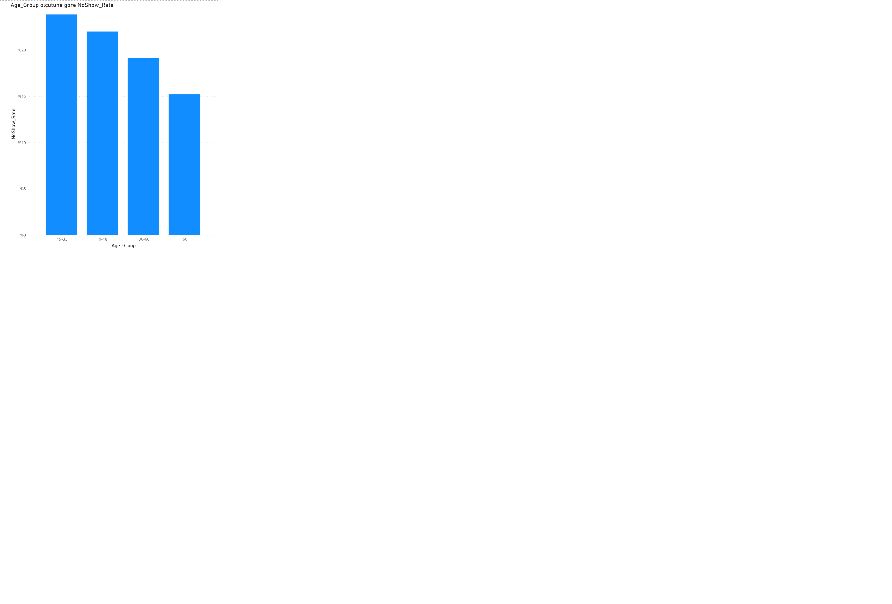
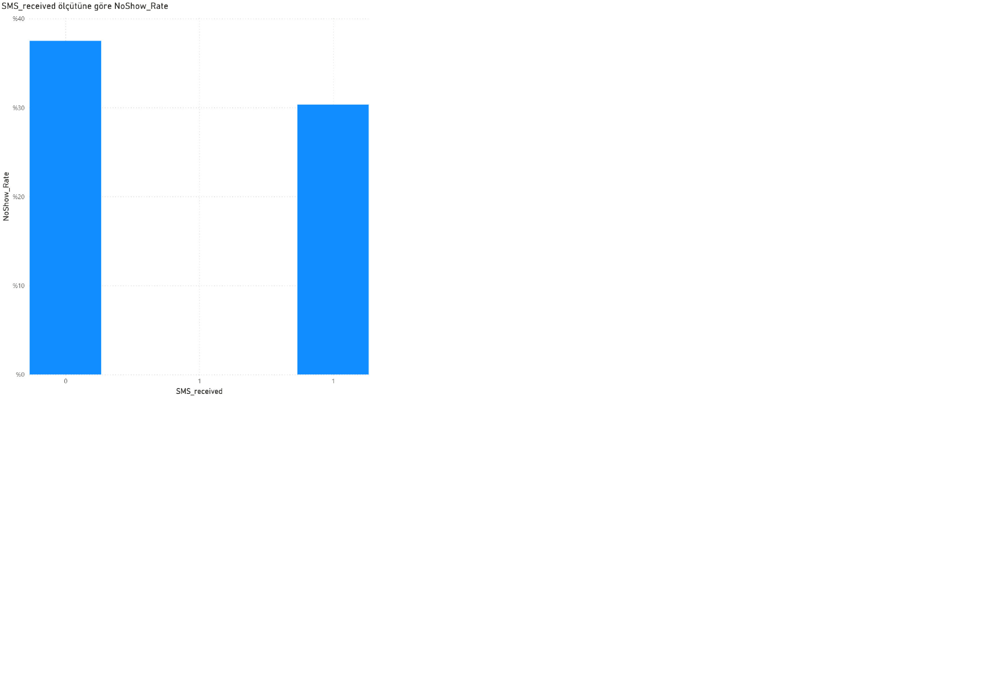

# Healthcare Appointment No-Show Analysis

## Problem
Patient no-shows create operational inefficiencies in healthcare systems by wasting clinical capacity and increasing waiting times. This project analyzes factors associated with appointment no-shows and evaluates whether SMS reminders are associated with reduced no-show rates.

## Dataset
Public healthcare appointment dataset including appointment dates, patient demographics, waiting time, SMS reminder status, and attendance outcomes.

## Methodology
- Data cleaning and feature engineering using Power BI
- Calculation of waiting time between scheduling and appointment
- Grouping of waiting times and age segments
- Comparison of no-show rates across groups
- Statistical validation using a two-tailed z-test for proportions

## Key Findings
- No-show rates increase as waiting time increases
- Patients with long waiting times (30+ days) are significantly more likely to miss appointments
- For appointments with waiting times over 30 days:
  - SMS reminders were associated with a **7 percentage point reduction** in no-show rates
  - The difference was statistically significant (**p < 0.001**)

## Business Insight
Targeting SMS reminders toward long-wait appointments can reduce missed visits and improve healthcare system efficiency without additional operational cost.

## Tools
- Power BI
- Python (pandas, statsmodels)
- Statistical hypothesis testing

## Notes
This is an observational analysis; results indicate association rather than causation.

## Key Visuals

### No-Show Rate by Waiting Time

### No-Show Rate by Age Group

### SMS Effect for 30+ Day Appointments
png)
